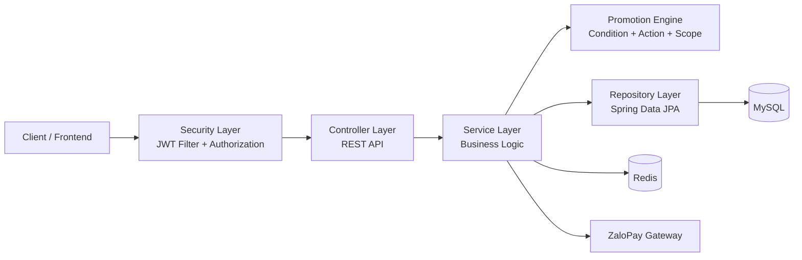
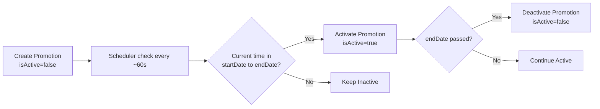

# Clothing Store Backend API

[](https://www.oracle.com/java/)
[](https://spring.io/projects/spring-boot)
[](https://maven.apache.org/)
[](https://www.mysql.com/)
[](https://redis.io/)
[](https://jwt.io/)

Backend thương mại điện tử cho cửa hàng thời trang, xây dựng theo kiến trúc nhiều lớp với đầy đủ nghiệp vụ cốt lõi: quản lý sản phẩm, giỏ hàng, đơn hàng, khuyến mãi linh hoạt theo chiến lược, ví voucher, đánh giá, hoàn tiền và tích hợp cổng thanh toán ZaloPay.

## 1. Công nghệ sử dụng

| Nhóm        | Công nghệ                      |
| ----------- | ------------------------------ |
| Language    | Java 21                        |
| Framework   | Spring Boot 3.5.6, Spring MVC  |
| Security    | Spring Security, JWT (jjwt)    |
| Persistence | Spring Data JPA, Hibernate     |
| Database    | MySQL                          |
| Cache       | Redis                          |
| API Docs    | springdoc-openapi (Swagger UI) |
| Mapping     | MapStruct                      |
| Validation  | Spring Validation              |
| Build Tool  | Maven                          |

## 2. Kiến trúc tổng quan

### 2.1 Bức tranh hệ thống



### 2.2 Luồng xử lý request

1. Client gọi API vào Controller.
2. Security Layer xác thực JWT và kiểm tra quyền (`ADMIN`/`CUSTOMER`).
3. Service xử lý nghiệp vụ chính (order, cart, promotion, refund...).
4. Service truy cập dữ liệu qua Repository (MySQL), dùng Redis khi cần cache/state.
5. Với thanh toán online, Service gọi ZaloPay và nhận callback để cập nhật trạng thái.

### 2.3 Promotion Engine (thiết kế mở rộng)

- `condition`: kiểm tra điều kiện (ví dụ `MIN_ORDER_AMOUNT`, `MIN_QUANTITY`).
- `action`: thực thi ưu đãi (ví dụ `PERCENT_DISCOUNT`, `FREE_SHIP`, `FREE_PRODUCT`).
- `scope`: xác định đối tượng áp dụng (`ALL_USER`, `SPECIFIC_USER`, `MEMBER_RANK`).

Mỗi thành phần là một strategy độc lập, nên thêm loại khuyến mãi mới mà không cần sửa toàn bộ luồng cũ.

### 2.4 Vòng đời khuyến mãi theo thời gian



## 3. Nghiệp vụ chính đã triển khai

- Xác thực và cấp token: đăng nhập, đăng ký, refresh token.
- Quản lý người dùng/khách hàng, hồ sơ cá nhân, địa chỉ giao hàng.
- Danh mục và sản phẩm: màu sắc, biến thể, tồn kho theo chi tiết sản phẩm.
- Giỏ hàng: thêm/sửa/xóa item, tính toán trước khi đặt hàng.
- Đơn hàng: tạo đơn, xem lịch sử, cập nhật trạng thái, hủy đơn.
- Khuyến mãi: tạo campaign, nhóm campaign, deactivate campaign.
- Ví voucher theo khách hàng.
- Đánh giá sản phẩm.
- Upload ảnh sản phẩm.
- Yêu cầu hoàn tiền: tạo yêu cầu, duyệt/từ chối/hoàn tất/hủy.
- Thanh toán ZaloPay: tạo order, nhận callback, truy vấn chi tiết giao dịch.

## 4. API modules

Base URL: `http://localhost:8080/api`

| Module          | Endpoint base                            |
| --------------- | ---------------------------------------- |
| Auth            | `/v1/auth`                               |
| Users           | `/v1/users`                              |
| Customers       | `/v1/customers`                          |
| Address         | `/address`                               |
| Categories      | `/v1/categories`                         |
| Products        | `/v1/products`                           |
| Cart            | `/v1/customers/me/cart`                  |
| Orders          | `/v1/orders`                             |
| Promotions      | `/v1/promotions`, `/v1/promotion-groups` |
| Voucher Wallet  | `/v1/customer/me/vouchers`               |
| Reviews         | `/v1/product/{productId}/reviews`        |
| Refund Requests | `/v1/refund-requests`                    |
| File Upload     | `/v1/file-upload`                        |
| ZaloPay         | `/v1/payments/zalopay`                   |

Swagger UI: `http://localhost:8080/api/swagger-ui/index.html`

## 5. Hướng dẫn tạo khuyến mãi

Endpoint tạo promotion:

- Method: `POST`
- URL: `http://localhost:8080/api/v1/promotions`
- Quyền: `ADMIN` (cần Bearer Token của tài khoản admin)

### 5.1 Cách khuyến mãi hoạt động trong hệ thống

1. Khi gọi create promotion thành công, promotion được lưu với `isActive=false`.
2. Job scheduler chạy mỗi ~60 giây để:
   - tự động kích hoạt promotion nếu `startDate <= now < endDate`.
   - tự động tắt promotion khi quá `endDate`.
3. Tùy loại promotion:
   - `AUTOMATIC`: hệ thống tự áp dụng khi đủ điều kiện.
   - `CONDITIONAL`: khi kích hoạt sẽ phát voucher vào ví theo `promotionScopeType`.
   - `COUPON_CODE`: người dùng nhập mã khi checkout.

Lưu ý thực tế để demo: đặt `startDate` lớn hơn hiện tại khoảng 1-2 phút, sau đó chờ tối đa 60 giây để job kích hoạt.

### 5.2 Bảng giá trị hợp lệ quan trọng

| Field                | Giá trị hợp lệ                                                                                                          | Ý nghĩa                                                                                                                    |
| -------------------- | ----------------------------------------------------------------------------------------------------------------------- | -------------------------------------------------------------------------------------------------------------------------- |
| `promotionType`      | `AUTOMATIC`, `CONDITIONAL`, `COUPON_CODE`                                                                               | Loại khuyến mãi: tự áp dụng, phát voucher theo điều kiện/scope, hoặc nhập mã khi checkout.                                 |
| `applicationType`    | `PRODUCT_LEVEL`, `ORDER_LEVEL`                                                                                          | Cấp áp dụng: trực tiếp lên sản phẩm/nhóm sản phẩm hoặc áp dụng trên tổng đơn hàng.                                         |
| `promotionScopeType` | `ALL_USER`, `SPECIFIC_USER`, `MEMBER_RANK`                                                                              | Phạm vi người nhận: tất cả khách, nhóm khách cụ thể, hoặc theo hạng thành viên.                                            |
| `conditionType`      | `MIN_ORDER_AMOUNT`, `MIN_QUANTITY`, `PRODUCT_SPECIFIC`                                                                  | Điều kiện kích hoạt khuyến mãi: đạt tiền tối thiểu, số lượng tối thiểu, hoặc thuộc nhóm sản phẩm mục tiêu.                 |
| `actionType`         | `PERCENT_DISCOUNT`, `FIXED_DISCOUNT`, `FREE_SHIP`, `FREE_PRODUCT`, `PRODUCT_PERCENT_DISCOUNT`, `PRODUCT_FIXED_DISCOUNT` | Hành động sau khi thỏa điều kiện: giảm %, giảm tiền, miễn phí ship, tặng sản phẩm, hoặc giảm trực tiếp theo nhóm sản phẩm. |

Ràng buộc logic quan trọng:

- `PRODUCT_LEVEL` bắt buộc:
  - `promotionType = AUTOMATIC`
  - tất cả `conditions` phải là `PRODUCT_SPECIFIC`
  - tất cả `actions` phải là `PRODUCT_PERCENT_DISCOUNT` hoặc `PRODUCT_FIXED_DISCOUNT`
  - phải có `promotionGroupIds`
- `ORDER_LEVEL`:
  - có thể dùng `MIN_ORDER_AMOUNT` + `PERCENT_DISCOUNT`/`FREE_SHIP`/`FREE_PRODUCT`
  - nếu dùng condition/action liên quan sản phẩm (`MIN_QUANTITY`, `PRODUCT_SPECIFIC`, `PRODUCT_*`) thì phải có `promotionGroupIds`
- Scope:
  - `SPECIFIC_USER` cần `targetUserIds`
  - `MEMBER_RANK` cần `targetMemberTierIds`
- Với `COUPON_CODE`: cần `usageLimit > 0`, `couponCode` có thể để trống (hệ thống tự sinh).

### 5.3 Cấu trúc value cho conditions/actions

`conditions[].value` thường dùng:

- `MIN_ORDER_AMOUNT`
  - `{ "minOrderAmount": 500000 }`
- `MIN_QUANTITY`
  - `{ "promotionGroupId": 1, "minQuantity": 2 }`
- `PRODUCT_SPECIFIC`
  - thường kết hợp `promotionGroupIds` ở root request

`actions[].value` thường dùng:

- `PERCENT_DISCOUNT`
  - `{ "discountPercentage": 10 }`
- `FIXED_DISCOUNT`
  - `{ "fixedDiscount": 50000 }`
- `FREE_SHIP`
  - `{ "discountPercentageShip": 100 }`
- `FREE_PRODUCT`
  - `{ "freeProductId": 12, "quantity": 1 }`
- `PRODUCT_PERCENT_DISCOUNT`
  - `{ "promotionGroupId": 1, "promtionGroupId": 1, "discountPercentage": 20 }`
- `PRODUCT_FIXED_DISCOUNT`
  - `{ "promotionGroupId": 1, "promtionGroupId": 1, "fixedDiscount": 30000 }`

### 5.4 Request mẫu dễ chạy nhất (khuyến mãi theo đơn hàng)

Ví dụ này phù hợp để demo nhanh vì ít phụ thuộc dữ liệu sản phẩm/phân nhóm:

```bash
curl -X POST "http://localhost:8080/api/v1/promotions" \
    -H "Authorization: Bearer <ADMIN_ACCESS_TOKEN>" \
    -H "Content-Type: application/json" \
    -d '{
        "promotionName": "GIAM10_DONHANG_500K",
        "description": "Giam 10% cho don tu 500k",
        "promotionType": "CONDITIONAL",
        "startDate": "2026-03-25T10:30:00",
        "endDate": "2026-04-30T23:59:59",
        "stackable": true,
        "couponCode": null,
        "usageLimit": null,
        "applicationType": "ORDER_LEVEL",
        "promotionScopeType": "ALL_USER",
        "conditions": [
            {
                "conditionType": "MIN_ORDER_AMOUNT",
                "value": { "minOrderAmount": 500000 }
            }
        ],
        "actions": [
            {
                "actionType": "PERCENT_DISCOUNT",
                "value": { "discountPercentage": 10 }
            }
        ]
    }'
```

### 5.5 Request mẫu cho PRODUCT_LEVEL (nâng cao)

```json
{
  "promotionName": "GIAM20_NHOM_AO_THUN",
  "description": "Giam 20% nhom ao thun",
  "promotionType": "AUTOMATIC",
  "startDate": "2026-03-25T10:40:00",
  "endDate": "2026-04-30T23:59:59",
  "stackable": true,
  "applicationType": "PRODUCT_LEVEL",
  "promotionScopeType": "ALL_USER",
  "promotionGroupIds": [1],
  "conditions": [
    {
      "conditionType": "PRODUCT_SPECIFIC",
      "value": {
      }
    }
  ],
  "actions": [
    {
      "actionType": "PRODUCT_PERCENT_DISCOUNT",
      "value": {
        "promotionGroupId": 1,
        "promtionGroupId": 1,
        "discountPercentage": 20
      }
    }
  ]
}
```

### 5.6 Cách kiểm tra sau khi tạo để chắc chắn chạy được

1. Kiểm tra response create trả về `success` và có `promotionId`.
2. Chờ scheduler chạy (tối đa ~60 giây).
3. Với promotion theo đơn hàng:
   - gọi endpoint preview order `POST /api/v1/orders/preview` kèm `promotionIds` để xem discount áp dụng.
4. Với promotion loại voucher (`CONDITIONAL` + scope phù hợp):
   - kiểm tra ví voucher của user qua `GET /api/v1/customer/me/vouchers`.
5. Nếu muốn tắt promotion:
   - gọi `PATCH /api/v1/promotions/deactivate` với body là số `promotionId`.

## 6. Cấu trúc thư mục

```text
src/main/java/com/example/clothingstore
|- config/        # Security, Redis, Swagger
|- controller/    # REST APIs
|- dto/           # Request/Response models
|- enums/         # Enum nghiệp vụ
|- exception/     # Global/business/security exception handling
|- filter/        # JWT filter
|- mapper/        # MapStruct mappers
|- model/         # JPA entities
|- repository/    # Spring Data repositories
|- service/       # Business logic
|- strategy/      # Promotion strategy engine
|- util/          # Utility classes
|- validator/     # Custom validations
```

## 7. Hướng dẫn chạy nhanh

### 7.1 Yêu cầu môi trường

- JDK 21
- Maven Wrapper (đã có sẵn trong dự án)
- MySQL
- Redis

### 7.2 Cấu hình

1. Sao chép file cấu hình:

```bash
cp src/main/resources/application.properties.example src/main/resources/application.properties
```

2. Điền các thông tin bắt buộc trong `application.properties`:

- `spring.datasource.url`
- `spring.datasource.username`
- `spring.datasource.password`
- `jwt.secret-key`
- `spring.data.redis.host`
- `spring.data.redis.port`
- `zalopay.*` (nếu test thanh toán)

### 7.3 Chạy ứng dụng

Windows:

```bash
./mvnw.cmd spring-boot:run
```

macOS/Linux:

```bash
./mvnw spring-boot:run
```

### 7.4 Chạy test

```bash
./mvnw test
```

## 8. Bảo mật và chất lượng

- Stateless authentication với JWT filter.
- `@EnableMethodSecurity` + `@PreAuthorize` cho endpoint nhạy cảm.
- Custom xử lý lỗi 401/403 tập trung.
- Validation cho request input, chuẩn hóa response qua `ApiResponse`.
