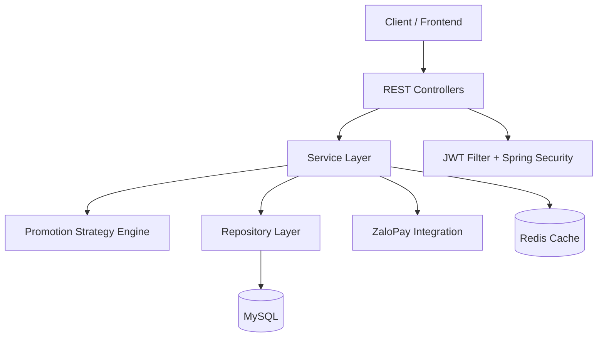

# Clothing Store Backend API

[](https://www.oracle.com/java/)
[](https://spring.io/projects/spring-boot)
[](https://maven.apache.org/)
[](https://www.mysql.com/)
[](https://redis.io/)
[](https://jwt.io/)

Backend thương mại điện tử cho cửa hàng thời trang, xây dựng theo kiến trúc nhiều lớp với đầy đủ nghiệp vụ cốt lõi: quản lý sản phẩm, giỏ hàng, đơn hàng, khuyến mãi linh hoạt theo chiến lược, ví voucher, đánh giá, hoàn tiền và tích hợp cổng thanh toán ZaloPay.

## 1. Công nghệ sử dụng

| Nhóm        | Công nghệ                      |
| ----------- | ------------------------------ |
| Language    | Java 21                        |
| Framework   | Spring Boot 3.5.6, Spring MVC  |
| Security    | Spring Security, JWT (jjwt)    |
| Persistence | Spring Data JPA, Hibernate     |
| Database    | MySQL                          |
| Cache       | Redis                          |
| API Docs    | springdoc-openapi (Swagger UI) |
| Mapping     | MapStruct                      |
| Validation  | Spring Validation              |
| Build Tool  | Maven                          |

## 2. Kiến trúc tổng quan



### Promotion Strategy Engine

- `action`: áp dụng kiểu ưu đãi (`PercentDiscount`, `FreeShip`, `FreeProduct`)
- `condition`: điều kiện kích hoạt (`MinOrderAmount`, `MinQuantity`)
- `scope`: phạm vi áp dụng (`AllUser`, `SpecificUser`, `MembershipRank`)

Thiết kế này giúp mở rộng chương trình khuyến mãi mới mà không ảnh hưởng logic cũ.

## 3. Nghiệp vụ chính đã triển khai

- Xác thực và cấp token: đăng nhập, đăng ký, refresh token.
- Quản lý người dùng/khách hàng, hồ sơ cá nhân, địa chỉ giao hàng.
- Danh mục và sản phẩm: màu sắc, biến thể, tồn kho theo chi tiết sản phẩm.
- Giỏ hàng: thêm/sửa/xóa item, tính toán trước khi đặt hàng.
- Đơn hàng: tạo đơn, xem lịch sử, cập nhật trạng thái, hủy đơn.
- Khuyến mãi: tạo campaign, nhóm campaign, deactivate campaign.
- Ví voucher theo khách hàng.
- Đánh giá sản phẩm.
- Upload ảnh sản phẩm.
- Yêu cầu hoàn tiền: tạo yêu cầu, duyệt/từ chối/hoàn tất/hủy.
- Thanh toán ZaloPay: tạo order, nhận callback, truy vấn chi tiết giao dịch.

## 4. API modules

Base URL: `http://localhost:8080/api`

| Module          | Endpoint base                            |
| --------------- | ---------------------------------------- |
| Auth            | `/v1/auth`                               |
| Users           | `/v1/users`                              |
| Customers       | `/v1/customers`                          |
| Address         | `/address`                               |
| Categories      | `/v1/categories`                         |
| Products        | `/v1/products`                           |
| Cart            | `/v1/customers/me/cart`                  |
| Orders          | `/v1/orders`                             |
| Promotions      | `/v1/promotions`, `/v1/promotion-groups` |
| Voucher Wallet  | `/v1/customer/me/vouchers`               |
| Reviews         | `/v1/product/{productId}/reviews`        |
| Refund Requests | `/v1/refund-requests`                    |
| File Upload     | `/v1/file-upload`                        |
| ZaloPay         | `/v1/payments/zalopay`                   |

Swagger UI: `http://localhost:8080/api/swagger-ui/index.html`

## 5. Cấu trúc thư mục

```text
src/main/java/com/example/clothingstore
|- config/        # Security, Redis, Swagger
|- controller/    # REST APIs
|- dto/           # Request/Response models
|- enums/         # Enum nghiệp vụ
|- exception/     # Global/business/security exception handling
|- filter/        # JWT filter
|- mapper/        # MapStruct mappers
|- model/         # JPA entities
|- repository/    # Spring Data repositories
|- service/       # Business logic
|- strategy/      # Promotion strategy engine
|- util/          # Utility classes
`- validator/     # Custom validations
```

## 6. Hướng dẫn chạy nhanh

### 6.1 Yêu cầu môi trường

- JDK 21
- Maven Wrapper (đã có sẵn trong dự án)
- MySQL
- Redis

### 6.2 Cấu hình

1. Sao chép file cấu hình:

```bash
cp src/main/resources/application.properties.example src/main/resources/application.properties
```

2. Điền các thông tin bắt buộc trong `application.properties`:

- `spring.datasource.url`
- `spring.datasource.username`
- `spring.datasource.password`
- `jwt.secret-key`
- `spring.data.redis.host`
- `spring.data.redis.port`
- `zalopay.*` (nếu test thanh toán)

### 6.3 Chạy ứng dụng

Windows:

```bash
./mvnw.cmd spring-boot:run
```

macOS/Linux:

```bash
./mvnw spring-boot:run
```

### 6.4 Chạy test

```bash
./mvnw test
```

## 7. Bảo mật và chất lượng

- Stateless authentication với JWT filter.
- `@EnableMethodSecurity` + `@PreAuthorize` cho endpoint nhạy cảm.
- Custom xử lý lỗi 401/403 tập trung.
- Validation cho request input, chuẩn hóa response qua `ApiResponse`.
